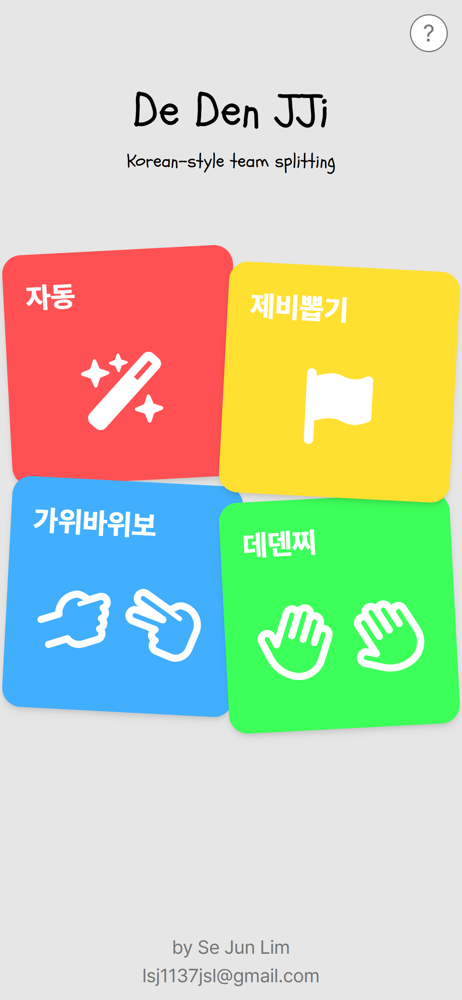
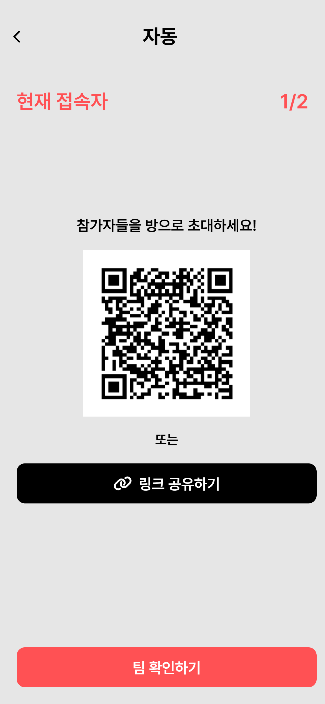
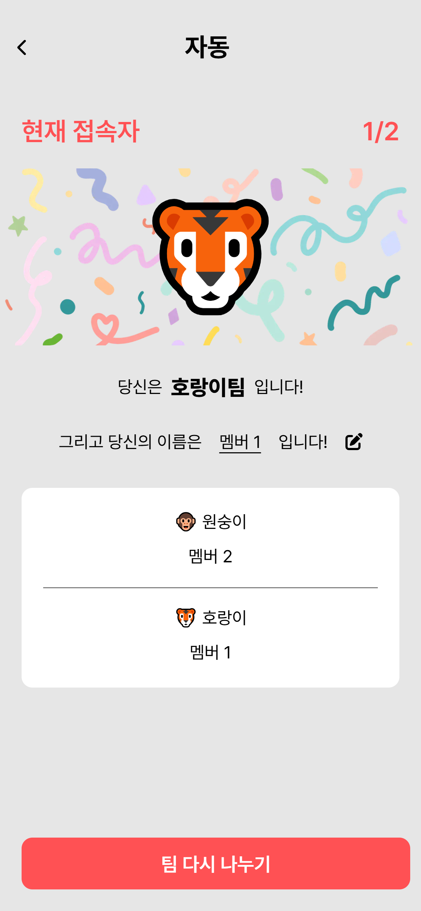
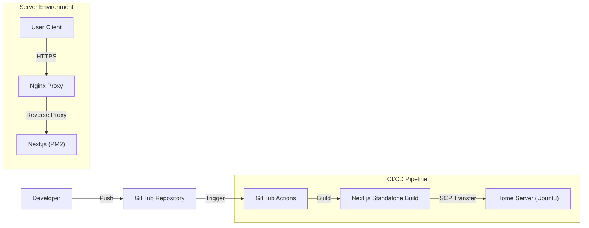

# 🖐️ 데덴찌 (Dedenjji)

> **우리만의 팀 나누기 방식 (Korean-style Team Splitting Service)**

[](https://dedenjji.3jun.store)
[](https://nextjs.org/)

## 📝 프로젝트 소개 (Introduction)

**데덴찌**는 한국의 전통적인 팀 나누기 구호인 '데덴찌'에서 착안하여 만든 웹 서비스입니다.  
친구, 동료들과 팀을 나눌 때 발생할 수 있는 번거로움을 해결하고, 다양한 미니 게임을 통해 즐겁게 팀을 구성할 수 있도록 돕습니다.

👉 **Live Demo:** [https://dedenjji.3jun.store](https://dedenjji.3jun.store)

## 📸 실행 화면 (Preview)
| 메인 화면 | 파티원 모집 화면 | 결과 화면 |
| :---: | :---: | :---: |
|  |  |  |

## ✨ 주요 기능 (Features)

* **🖐️ 데덴찌 (Dedenjji):** 지역별, 인원별 다양한 구호를 통한 팀 나누기 시뮬레이션
* **🤖 자동 팀 나누기 (Auto Split):** 인원 수와 팀 수만 입력하면 밸런스 있게 자동 분배
* **🎰 제비뽑기 (Draw Lots):** 꽝 뽑기, 역할 정하기 등 스릴 넘치는 제비뽑기
* **✊✌️🖐️ 가위바위보 (Rock Paper Scissors):** 간편한 승부 결정

## 🛠️ 기술 스택 (Tech Stack)

### Frontend
* **Framework:** Next.js 14 (App Router)
* **Language:** TypeScript
* **Styling:** Tailwind CSS
* **State Management:** Zustand

### Infrastructure & DevOps
* **Hosting:** Home Server (Ubuntu 22.04)
* **CI/CD:** GitHub Actions
* **Process Manager:** PM2
* **Server:** Nginx (Reverse Proxy)

## 📂 프로젝트 구조 (Directory Structure)

```
📦 src  
├── 📂 app                       # Next.js App Router (페이지 라우팅)  
│   ├── 🤖 auto                  # [기능] 자동 팀 나누기  
│   │   ├── ⚙️ setting           # ┗ 설정 페이지 (인원 수 등)  
│   │   └── 🎉 result            # ┗ 결과 페이지  
│   ├── 🖐️ dedenjji              # [기능] 데덴찌 (메인 기능)  
│   │   ├── ⚙️ setting  
│   │   └── 🎉 result  
│   ├── 🎟️ draw                  # [기능] 제비뽑기   
│   │   ├── ⚙️ setting  
│   │   └── 🎉 result  
│   └── ✌️ rock-scissor-paper    # [기능] 가위바위보  
│       ├── ⚙️ setting  
│       └── 🎉 result  
├── 🧩 components                # 재사용 가능한 공통 UI 컴포넌트  
├── 🎣 hooks                     # 커스텀 리액트 훅 (Custom Hooks)  
├── 💾 store                     # 전역 상태 관리 (State Management)  
├── 🎨 styles                    # 전역 스타일 및 CSS 설정  
├── 🏷️ types                     # TypeScript 타입 정의 (.d.ts 등)  
└── 🛠️ utils                     # 공통 유틸리티 함수 모음  
```

## 🏗️ 시스템 아키텍처 (System Architecture)

GitHub Actions와 홈 서버를 활용한 CI/CD 파이프라인입니다.



## 🚀 시작하기 (Getting Started)

로컬 환경에서 프로젝트를 실행하는 방법입니다.

### 1. 설치 (Installation)

```bash
# 저장소 클론
git clone https://github.com/lsj1137/dedenjji.git

# 프로젝트 폴더로 이동
cd dedenjji

# 의존성 설치
npm install

# 실행
npm run dev
```

© 2024 Dedenjji. All rights reserved.
